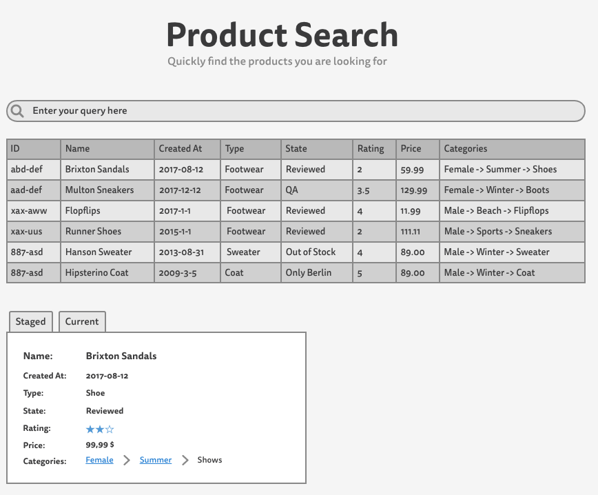
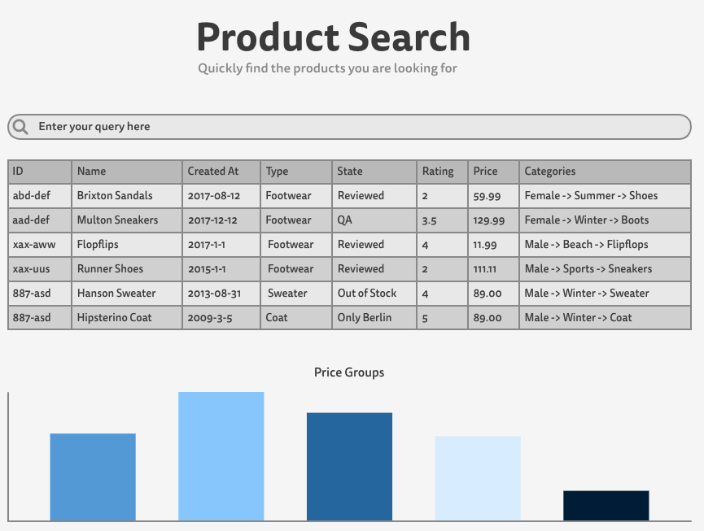

  
  <b>Commercetools Frontend Coding Task</b>

> This is our frontend coding task which will be accessible to you for one week. After we will remove your access to the repository again. Please read through the instructions and get back to us in case of questions.

## Task

Create a table view of the products provided with the [API server](http://localhost:4000). An example wireframe is attached to give visual indication of what the result could look like.

This data structure for the coding task is similar to our APIs response format documented [here](https://dev.commercetools.com/http-api-projects-products.html#product). Not all fields are populated in our fixture but our documentation can serve as explanatory material.

You can pick one of two options for which we have received the following Acceptance Criteria. **Please do not complete both**.

### Option 1: Table with additional tabbed information

The general idea is that our users can get a quick overview of products in a table with the ability to filter the table by product names. Furthermore, more detailed information is shown when clicking on a product (table row).

The table should have the following columns with headers:

`id`, `name`, `createdAt`, `productType`, `state`, `averageRating`, `price`, `categories`

- _Given:_ the user types in the input field
   - _Then:_ without hitting enter the table's products should be filtered to contain only products whose name match the query
- _Given:_ the user clicks on a product in the table
   - _Then:_ product's meta information should be shown under the table with two tabs: `current` and `staged`
   - _Given:_ the user clicks on the `current` tab
      - _Then:_ the product's `current` information is shown
   - _Given:_ the user clicks on the `staged` tab
      - _Then:_ the product's `staged` information is shown
   - Each tab should contain the table row's data as well as: `version`, `modified` and the relating information from `current` or `staged`: `description`, `keywords` and each variants `name`

__Note__: The design and layout is up to you. The wireframe is only serves for clarification. The only constraint is that all content should be _horizontally and vertically centered_ at all times.

### Option 2: Table with accompanying chart showing bucketed prices

The general idea is the same as in the previous option. Our users can get a quick overview of products in a table with the ability to filter the table by product names. Furthermore, a chart accompanies the table giving an overview of price range of the visible products in the table in five "buckets". Imagine having found 25 products with different prices. Those prices should now be dynamically placed into five buckets each holding products of a specific price range. The user can now see what products e.g. as in the price range (bucket) of 0$ to 25$, 26$ to 50$ and so forth.

The table should have the following columns with headers:

`id`, `name`, `createdAt`, `productType`, `state`, `averageRating`, `price`, `categories`

- _Given:_ the user types in the input field
   - _Then:_ without hitting enter the table's products should be filtered to match only products matching the queries name
   - _Then:_ the chart's price buckets should update in relation to what is visible in the table
- _Given:_ the user hovers or clicks onto a section (e.g. bar or slice) of the chart

__Note__: The design and layout is up to you. The wireframe is only serves for clarification. The only constraint is that all content should be _horizontally and vertically centered_ at all times.

## Getting started and using the provided API

1. Ensure that [nvm](https://github.com/creationix/nvm) or Node v8.* is installed (for the provided API)
  - With `nvm` just run `nvm use` to switch to Node 8 via the provided `nvmrc`
2. Make sure you have [yarn](https://yarnpkg.com/lang/en/) or npm installed
3. Run `yarn` or `npm install` to install dependencies
4. Run `yarn start:api` or `npm run start:api`

The existing API, as mentioned above, can be started by running `yarn start:api` or `npm run start:api`. The API runs under `localhost:4000`. Your shell should have listed some example endpoints already.

- `localhost:4000/` returns health indication of the server
- `localhost:4000/products` returns all products stored within `packages/api/__fixtures__/products.json`
- `localhost:4000/products/:id` returns (if existent) a product matching the id
- `localhost:4000/search/:q` returns all matching products (by name)
  - Note that the `/search` always returns the `current` representation of a matching product. To access `staged` you have to use `products/:id`
  - The `/search` endpoint accepts optional `offset` and `limit` parameters for pagination if needed `localhost:4000/search/?limit=1&offset=3` or `localhost:4000/search/Multon?limit=1&offset=3`

The API fulfills the needs of this tasks but sometimes may be a bit flaky on purpose.

## How to go about this task

- Feel free to pick the setup, tools and framework you prefer
- If applicable highlight areas you want to emphasize (decisions, code or architecture)
- We recommend you spend no more than 8h on this task as we do not want to take up too much of your time. If you do not manage to finish on time, please do not worry and send us what you have anyway. We just want to see how you code.
- The code should be of a quality you consider "ready for production".
- The feature-set described above is minimal. If you happen to implement additional functionalities you can argue to be helpful to the user you are free to implement them. Provide your reasoning.
- Please provide us with feedback about this task: what was unclear, where we can improve etc.

## What we will be looking at

- The structure of the code and any markup
- The modularity of your code
- The sustainability of the chosen technologies
- Styles and types of tests when present
- Documentation and maintainability

## Submitting a completed task

Just push your changes to `master` or a custom branch in one or incremental commits to the repository provided to you. Please do not fork the repository.

## Additional Information

The browser statistics for you target audience:

| Browser     | Percentage |
| :---------: | :--------: |
| Chrome 56+  | 48%        |
| Firefox 55+ | 22%        |
| Edge 14+    | 12%        |
| Safari 10.1 | 9%         |
| IE11        | 8%         |
| Other       | 1%         |
